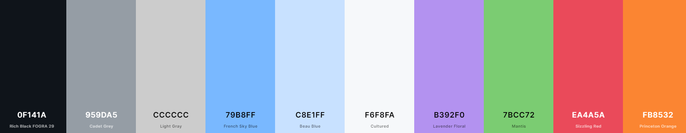

# GitHub Dark for RStudio

A 'Total IDE' build of the GitHub Dark theme for RStudio.



## Installation

**FIRST**: In RStudio, go to Global Options -> Appearance and ensure either `Modern` or `Sky` are selected as the `RStudio Theme` at the top

### Automatic

Run the following snippet in the RStudio Console:

```r
rstudioapi::addTheme('https://raw.githubusercontent.com/johnnybarrels/rstudio-one-dark-pro-theme/master/OneDarkPro.rstheme', apply=TRUE, force=TRUE)
```

Note that this will override any other theme named 'GitHub Dark' you may have (this can be controlled by removing the `force=True` argument).

If you get the error:
```r
Error in loadNamespace(name) : there is no package called 'rstudioapi'
```
run `install.packages('rstudioapi')` and try again.

### Manual

- Download the `github-dark.rstheme` file from this repository (or clone)
- In RStudio go to Global Options -> Appearance, and click the `Add...` button under Editor Theme
- Navigate to the downloaded `github-dark.rstheme` file, hit `Open` and you're good to go

### Info

This theme was adapted from [this theme](https://github.com/StylishThemes/GitHub-Dark/blob/master/src/themes/github/github-dark.css). The editor font I use is [Fira Code](https://github.com/tonsky/FiraCode), and the majority of the UI font is [Open Sans](https://fonts.google.com/specimen/Open+Sans). It is not necessary to install these.
